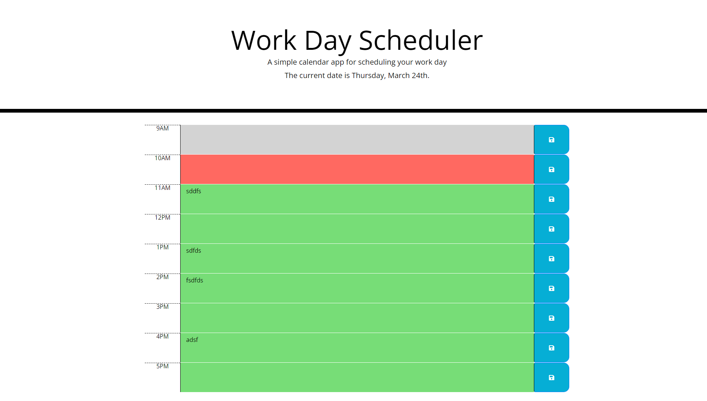

# Work Day Planner

The goal of this was to fulfill the user story in which it was requested that the following page be able to record events for the user (employee) to plan around.

## About the Project

[Workday Scheduler](https://pldbrja.github.io/day-2-day-planner/)

This is a single day schedule for sorting events happening throughout the user's work day in an orderly format that allows for any inputs into the textarea elements to be stored in the localStorage of the page, available upon any reload.

The Jumbotron at the top of the page gives the user the current date, in the format of the day of the week and month.

Each textarea with the .description class is given a data attribute of "data-store" which contains the hour of the parent's div in a 24-hour format. The background of each description will change color depending on the recorded time of the user through the Moment.js moment.hour() method. A function logs both the data-store and user's time in a comparison format to decide if the entry is in the past, present, or future.

The ID and description recorded from the user's input are set in localStorage. The retrieval process uses the value of each ID to pull the respective key, which prevents any of the descriptions from being set in the wrong space.

## Tools

* Moment.js 2.24.0
* jQuery 3.2.1
* Bootstrap 4.3.1

## Screenshots

